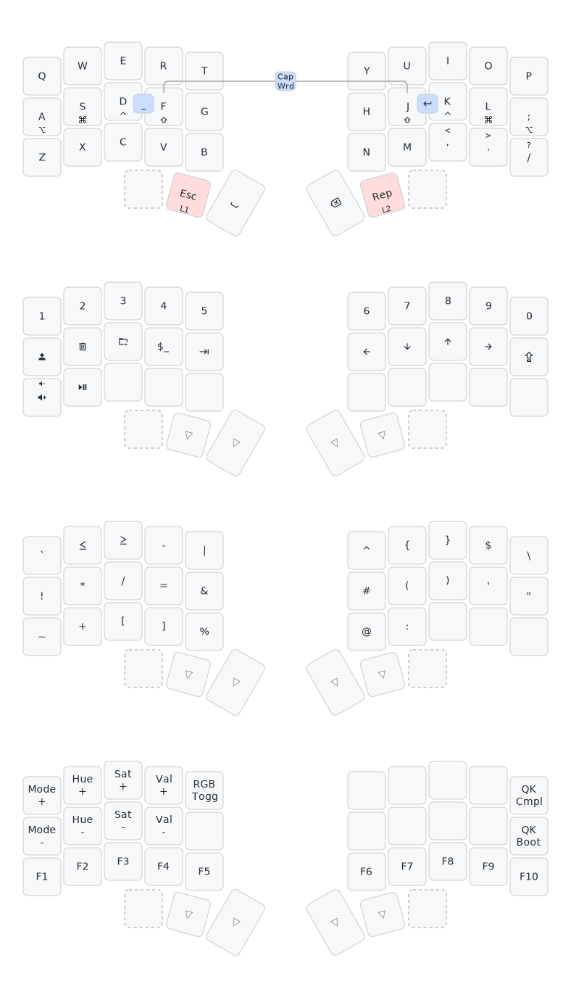

## qmk.me
This is a self-contained repository for my personal [QMK](https://github.com/qmk/qmk_firmware) userspace & keyboard code.


### building
Symlinks are used to compile this code in a proper `qmk_firmware` repository.

eg.
```shell
ln -s qmk.me/jack qmk_firmware/users/jack
ln -s qmk.me/keyboards/relic qmk_firmware/keyboards/relic
echo "users/jack\nkeyboards/relic" >> qmk_firmware/.git/info/exclude
qmk compile -kb relic -km jack
```
The official external [userspace feature](https://docs.qmk.fm/newbs_external_userspace)  is not used as this repository contains personal keyboards, which are not supported.

### layout
A simple 34-key layout that makes use of 2 (primary) layers, home-row mods, & combos for many symbols. Mostly used in Sway, Vim (C, Python), & other generic computing tasks.


