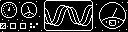
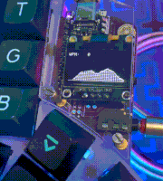

### qmk.me
this is a self-contained repository for my personal [qmk](https://github.com/qmk/qmk_firmware) userspace & keyboard code.\


### building
symlinks are used to compile this code in a proper `qmk_firmware` repository.\
eg.
```shell
ln -s ~/qmk.me/waffle ~/qmk_firmware/users/waffle
ln -s ~/qmk.me/keyboards/relic ~/qmk_firmware/keyboards/relic
echo "users/waffle\nkeyboards/relic" >> ~/qmk_firmware/.git/info/exclude
qmk compile -kb relic -km waffle

```

### layout


### combos
[combos.h](waffle/combos.h) contains macros that allow for combos be simply defined in a `combos.def` file as
```
CMB(<name>,  <output>,  <trigger keycodes>)
```
`#define COMBO_TERM 40`
| trigger | output (single/double tap) |
| :-----: | :------------------------: |
| r + u   | enter                      |
| v + m   | ?                          |
| t + y   | :                          |
| b + n   | _                          |
| s + l   | +                          |
| d + k   | =                          |
| g + h   | ' / "                      |
| w + o   | - / —                      |
| e + r   | { / }                      |
| u + i   | [ / ]                      |
| e + i   | \ / \|                     |
| d + f   | left click                 |
| f + g   | right click                |

### oled
[font file](waffle/oledfont.h) can be viewed and modified at [qmk logo editor](https://joric.github.io/qle)\
all the boring animation code is stored in [oled.h](waffle/oled.h)

**animations:**\
[felix the dog](https://github.com/waffle87/qmk.me/blob/master/waffle/oled.c#L128-#L149)\
    \
[layer animation](https://github.com/waffle87/qmk.me/blob/master/waffle/oled.c#L203-#L226)\
\
\
\
[wpm graph](https://github.com/waffle87/qmk.me/blob/master/waffle/oled.c#L170-#L201)\
\
[bongo cat](https://github.com/waffle87/qmk.me/blob/master/waffle/oled.c#L151-#L168)

the below snippet is used to render the big byte arrays used by animations.
where `size` is the array size and `action` is the animation frame name.
```c
void anim_frame(uint16_t size, char const action[][size]) {
  static uint8_t current_frame = 0;
  current_frame = (current_frame + 1) & 1;
  oled_write_raw_P(action[current_frame], size);
}
```
**custom timeout:**\
some animations don't respect `OLED_TIMEOUT`, so a custom timeout from [drashna](https://github.com/qmk/qmk_firmware/blob/master/users/drashna/oled/oled_stuff.c) can be used.
(this depends on `OLED_DISABLE_TIMEOUT` & `SPLIT_OLED_ENABLE` being defined)
```c
uint32_t oled_timer = 0;

bool oled_task_user(void) {
  if (is_keyboard_master()) {
    if (timer_elapsed32(oled_timer) > 180000) { //turn off after 3min
      oled_off();
      return false;
    } else
      oled_on();
  }
  if (!oled_task_keymap())
    return false;
  return false;
}

void oled_timer_reset(void) {
  oled_timer = timer_read32();
}
```
`oled_timer_reset()` just needs to be called from `process_record_user()`:
```c
if (record->event.pressed)
  oled_timer_reset();
```
the above snippet is also neat because global oled behavior can be placed in `oled_task_user`,
while keyboard specific oled code, like rendering certain things, can go in `oled_task_keymap`.

### raw hid
data is stored in a [typedef](https://github.com/waffle87/qmk.me/blob/master/waffle/waffle.h#L11-#L16) and [assigned](https://github.com/waffle87/qmk.me/blob/master/waffle/waffle.c#L7-#L11) when info is sent by the host.\
[raw.py](waffle/raw.py) is a basic implementation modified from [rawhid in python](https://gist.github.com/fauxpark/03a3efcc7dbdfbfe57791ea267b13c55).
renders current time on oled display:
```c
void host_info(uint8_t data) {
  char buffer[3];
  oled_write_P((char*)itoa(data, buffer, 10), false);
}

void render_time(void) {
  if (user_state.hour < 10)
    oled_write_P(PSTR("0"), false);
  host_info(user_state.hour);
  oled_write_P(PSTR(":"), false);
  if (user_state.min < 10)
    oled_write_P(PSTR("0"), false);
  host_info(user_state.min);
}
```
### tap dances & custom keycodes
macro to help circumvent mod-tap/16-bit keycode limitation:
```c
#define INTERCEPT_MOD_TAP(mod, keycode)             \
case mod(keycode):                                  \
  if (record->tap.count && record->event.pressed) { \
    tap_code16(keycode);                            \
    return false;                                   \
  }                                                 \
  break;                                            \

```
which can be called from `process_record_user` as `INTERCEPT_MOD_TAP(LALT_T, KC_EXLM)` for example.

| keycode  | action (single/double/triple tap)             |
| :------: | :-------------------------------------------: |
| `DEG_0`  | 0 / °                                         |
| `PNP`    | play/pause / skip/next / back/prev            |
| `CLIPST` | paste (term) / search (term) / layer 2 (hold) |
| `UPDIR`  | ../                                           |
| `RWORD`  | outputs a random word ([dict.h](https://raw.githubusercontent.com/qmk/qmk_firmware/master/users/ridingqwerty/dict.h)) |

### some keyboards
[crkbd](keymaps/crkbd)\
[kyria](keymaps/kyria)\
[ferris](keymaps/ferris)\
[microdox](keymaps/microdox)\
[relic](keyboards/relic)\
[vault35](keyboards/vault35)\
[xyz60](keyboards/xyz60)\
[f60](kemaps/f60)\
[minidox](keyboards/minidox)\
[leftover30](keyboards/leftover30)
