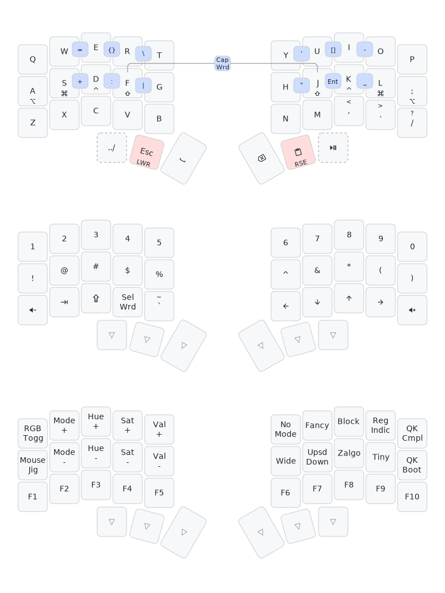

### qmk.me
this is a self-contained repository for my personal [qmk](https://github.com/qmk/qmk_firmware) userspace & keyboard code.


### building
symlinks are used to compile this code in a proper `qmk_firmware` repository.

eg.
```shell
ln -s ~/qmk.me/waffle ~/qmk_firmware/users/waffle
ln -s ~/qmk.me/keyboards/relic ~/qmk_firmware/keyboards/relic
echo "users/waffle\nkeyboards/relic" >> ~/qmk_firmware/.git/info/exclude
qmk compile -kb relic -km waffle
```
the official [userspace feature](https://docs.qmk.fm/newbs_external_userspace) 
is used as this repository contains personal keyboards, which are not supported.

### layout
a simple 34-key layout that makes use of 2 (primary) layers, home-row mods, & combos for many symbols.
mostly used in sway, vim (c, python), & other generic computing tasks.


